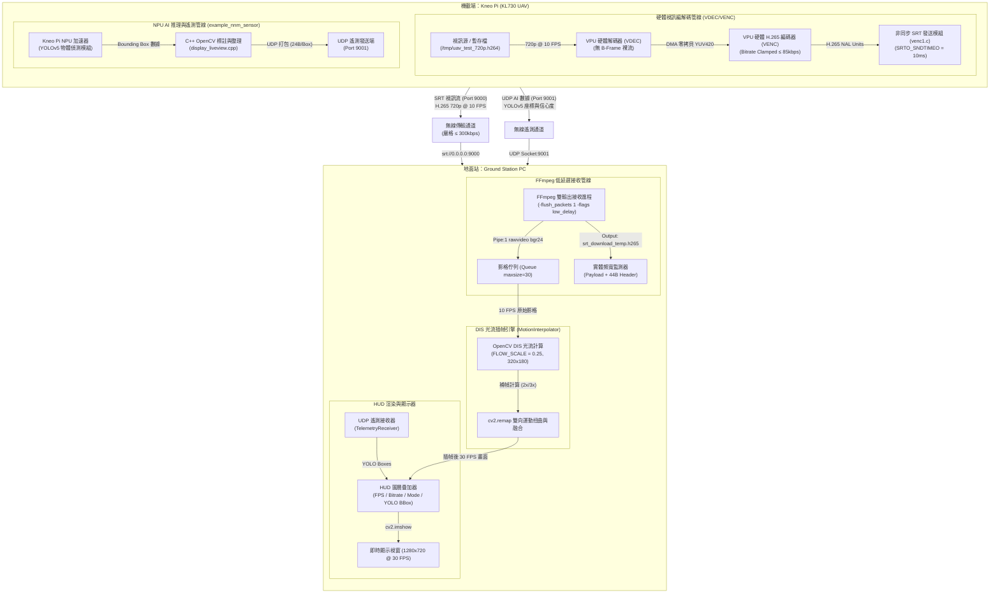

# UAV Kneron Pi (KL730) 邊緣分工低頻寬圖傳與 AI 遙測系統

本專案是一個基於 Kneo Pi (KL730) 開發板與地面站電腦（Ground PC）所開發的無人機低頻寬影像傳輸與即時 AI 遙測系統。

系統採用 **邊緣分工架構 (Scheme B)**：
* **機載端 (Kneo Pi)**：專注於高效能的 **VPU 硬體視訊編碼** 與 **NPU YOLOv5 即時目標偵測**，不進行耗時的插幀。
* **地面站 (Ground PC)**：透過 SRT 接收低碼率影像流，接收 UDP 遙測數據，並藉由 **DIS 光流法 (Optical Flow) 進行地端即時插幀補償 (10 FPS -> 30 FPS)** 與 HUD 標註疊加，從而在頻寬低於 85 kbps 的極端條件下實現 30 FPS 的流暢觀看體驗。

---

## 📂 專案目錄與部署說明 (Deployment Locations)

為配合開發板與地面站的運作，本專案已重構為以下結構：

```text
UAV_kneronpi/
├── README.md                  # 本說明文件（專案總覽與引導）
├── .gitignore                 # 全域 Git 忽略配置
├── ground_station/            # 【地面站端】專用目錄 (執行於地端 PC)
│   ├── ground_station.py      # 地面站 HUD 接收器、光流插幀引擎
│   ├── requirements.txt       # 地面站依賴套件清單
│   └── README.md              # 地面站詳細操作手冊
└── work/                      # 【機載端】專用目錄 (執行於 Kneo Pi 開發板)
    ├── start_stream           # 一鍵自適應啟動圖傳 Bash 腳本
    ├── 0717/uav_deploy_pack/  # 系統部署包（含守護進程與架構說明）
    ├── ai_application/        # 執行於 NPU 上的 AI 應用 (YOLOv5)
    ├── hardware_control/      # 視訊採集與 VPU 硬體編碼限制模組 (venc1.c)
    ├── peripherals/           # 邊緣感測器與控制硬體 (C / Python)
    ├── memory_control/        # 記憶體與 DMA 零拷貝緩衝配置
    └── test/                  # 常用硬體探測與相機測試工具
```

> [!IMPORTANT]
> **開發板部署路徑要求**：
> **`work/` 目錄下的所有內容，在部署至開發板時必須放置於開發板的 `/work` 目錄下**（即路徑需為 `/work/...`，例如 `/work/start_stream`）。專案內的自適應守護進程、啟動腳本與編譯路徑皆以此目錄進行定位，請勿變動。

---

## 📐 系統架構 (End-to-End Architecture)

本系統將繁重的影像插幀及 HUD 渲染工作交由地端處理，以釋放機載端 (UAV) 的 CPU/NPU 運算資源：



---

## ⚙️ 關鍵組件與技術參數

### 1. 機載端 (Airborne `work/` 目錄)
* **硬體 H.265 編碼 (`venc1.c`)**：
  * 解析度：`1280x720` (720p) @ 10 FPS。
  * 頻寬限制：編碼位元率硬性鎖定在 **`85,000 bps` (85 kbps)**，最大抑制 I-Frame 頻寬爆發。
  * 發送保護：設定 `SRTO_SNDTIMEO = 10` (10ms)，若遇到網路卡頓自動捨棄過期影格，避免緩衝積壓與圖傳延遲。
* **NPU YOLOv5 AI 偵測**：
  * 使用 Kneo Pi NPU 加速器即時辨識目標物，並透過 UDP Socket (Port 9001) 傳送邊框座標數據（每框 24 位元組），避免將標註渲染在視訊流中佔用額外編碼頻寬。

### 2. 地面站 (Ground PC `ground_station/` 目錄)
* **DIS 光流插幀 (Motion Interpolation)**：
  * 採用 `cv2.DISOpticalFlow` 演算法。
  * **降採樣加速 (FLOW_SCALE = 0.25)**：將 720p 影像降至 `320x180` 進行光流場計算，運算時間控制在 **< 1.5ms**，有效避免卡頓。
* **高精度 FPS 步進器**：
  * 使用 Python `time.perf_counter` 構建 33.33ms 的步進計時器，實現極穩定的 30.0 FPS HUD 渲染與輸出。

---

## 📊 效能基準測試數據 (Resource Benchmark Report)

本專案對比了 **FFmpeg 軟體編碼 (libx264)** 與 **Kneo Pi VPU 硬體編碼 (venc1)** 在處理相同影像來源時的系統負載表現：

| 監測項目 | FFmpeg 軟體編碼 (`libx264`) | Kneo Pi VPU 硬體編碼 (`venc1`) | 效能差異與效益 |
| :--- | :--- | :--- | :--- |
| **進程 CPU 平均使用率** | **12.23%** | **1.70%** | **CPU 負載降低約 86%** (~7.2 倍效能提升) |
| **進程 CPU 最高使用率** | **35.40%** | **1.70%** | 硬體編碼無 CPU 突發高負載現象，表現穩定 |
| **進程記憶體最高佔用** | **51.59 MB** | **18.46 MB** | 硬體編碼記憶體佔用恆定，不易造成 OOM |

> **效益**：使用 VPU 硬體編碼能將 86% 的進程 CPU 資源釋放出來，提供給機載端的 YOLOv5 AI 物態推論、飛控邏輯與感測器通訊使用。

---

## 🚀 快速上手與操作指南

### 1. 部署與啟動步驟

#### **步驟 A：啟動地面站 (Ground Station)**
在地端 PC（Windows / Linux / macOS）進入 `ground_station` 目錄，安裝依賴並執行：
```bash
pip install -r requirements.txt
python ground_station.py
```
> 地面站會開始監聽 Port 9000 (SRT 影音) 與 Port 9001 (YOLO UDP)，同時在 UDP Port 9002 廣播心跳封包以喚醒無人機端的守護進程。

#### **步驟 B：啟動機載端 (Airborne UAV)**
將本專案的 `work` 目錄複製到開發板的 `/work` 路徑下。登入開發板終端機，執行以下一鍵啟動指令：
```bash
cd /work
./start_stream
```
* **參數選擇**：
  * `./start_stream --mipi` : 強制由 MIPI CSI 相機介面讀取畫面編碼。
  * `./start_stream --usb`  : 強制由 USB 外接相機讀取畫面編碼。
  * `./start_stream --file` : 使用內建的模擬影片檔案進行串流測試。
  * `./start_stream <地面站IP>` : 手動指定地面站 IP，跳過自動搜索。

---

## 🎮 地面站鍵盤控制快捷鍵

地面站畫面視窗啟動後，支援以下即時控制鍵：

| 按鍵 | 功能分類 | 詳細操作說明 |
| :--- | :--- | :--- |
| **`ESC`** | 系統控制 | 立即關閉並退出地面站程式。 |
| **`A` / `a`** | 播放模式 | 切換為 **自動插值 (AUTO)** 模式。 |
| **`D` / `d`** | 播放模式 | 切換為 **直接播放 (DIRECT)** 模式。完全不進行光流插值運算。 |
| **`I` / `i`** | 播放模式 | 切換為 **強制插值 (INTERPOLATION)** 模式。 |
| **`M` / `m`** | 倍率控制 | 切換 **自動自適應倍率 (AUTO Adaptive)** 與 **手動固定倍率 (MANUAL)**。 |
| **`3`** | 倍率控制 | 直接切換為 **手動固定 3x 插值倍率 (MANUAL(3x))**。 *(推薦啟動後立即使用)* |
| **`4`** | 倍率控制 | 直接切換為 **手動固定 4x 插值倍率 (MANUAL(4x))**。 |
| **`5`** | 倍率控制 | 直接切換為 **手動固定 5x 插值倍率 (MANUAL(5x))**。 |
| **`6`** | 倍率控制 | 直接切換為 **手動固定 6x 插值倍率 (MANUAL(6x))**。 |
| **`+` 或 `=`** | 倍率控制 | 增加 1x 手動插值倍率（上限 8x）。 |
| **`-` 或 `_`** | 倍率控制 | 減少 1x 手動插值倍率（下限 1x）。 |
| **`U` / `u`** | 遠端控制 | 遠端控制無人機，切換為 **USB Port 攝影機**。 |
| **`P` / `p`** | 遠端控制 | 遠端控制無人機，切換為 **MIPI Port 攝影機**。 |
| **`F` / `f`** | 遠端控制 | 遠端控制無人機，切換為 **影片模擬串流**。 |

> [!TIP]
> **最佳實踐提示**：
> 為了獲得最平滑且低延遲的 30 FPS 觀看體驗，**建議您在啟動地面站程式後，立刻按下鍵盤上的 `3` 鍵** 切換至手動 3x 插值模式。
